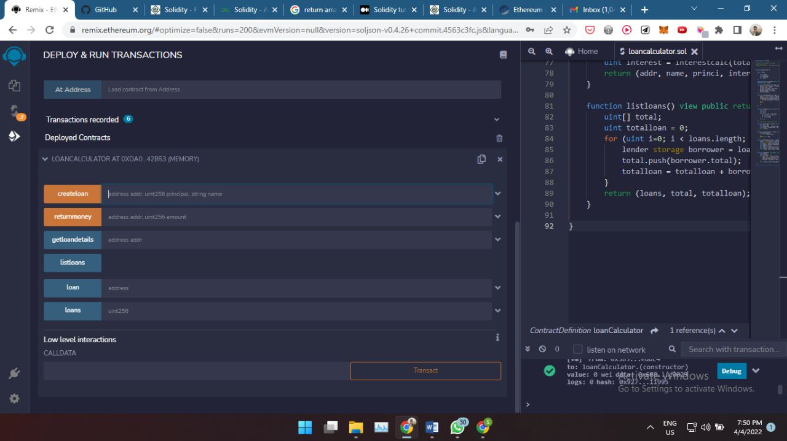
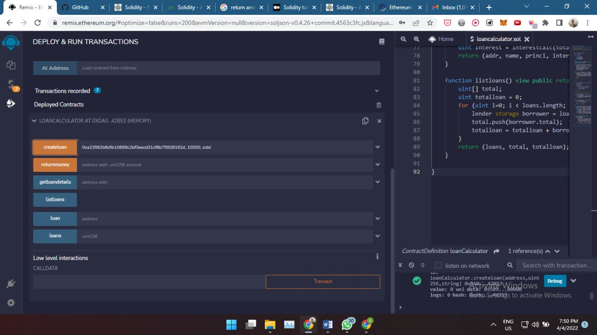
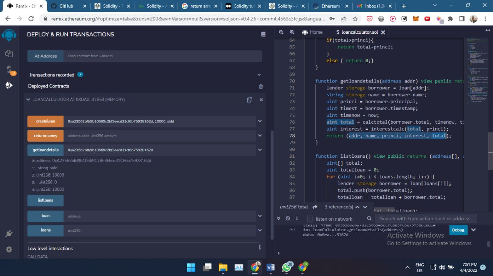
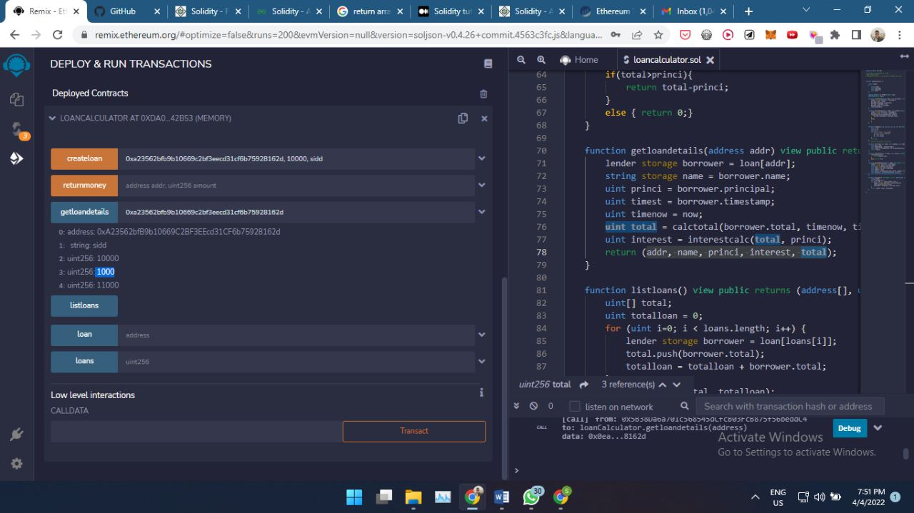
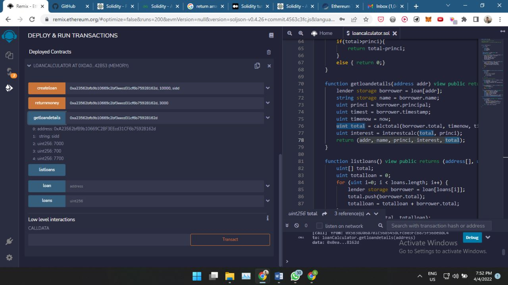
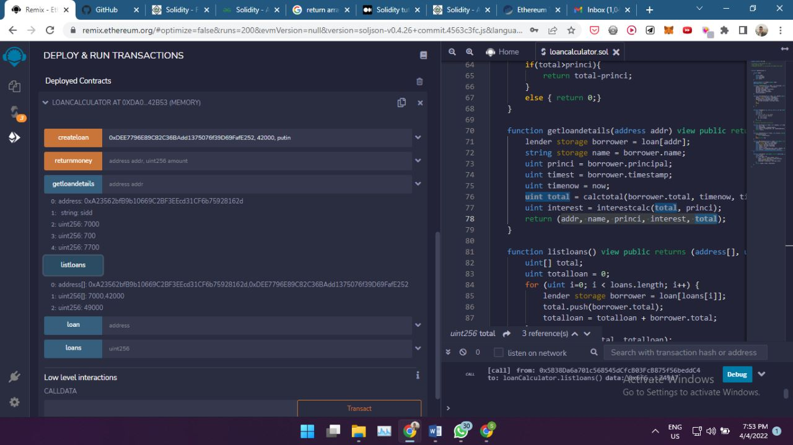

# LOAN MANAGEMENT

Simple solidity program which can create loans, calculate interest, manage returns, list all loans.
Loan creation and loan return are public blockchain transactions and all the loans are stored publically.

Create loan

Get details

Return Loan

Get all loans

